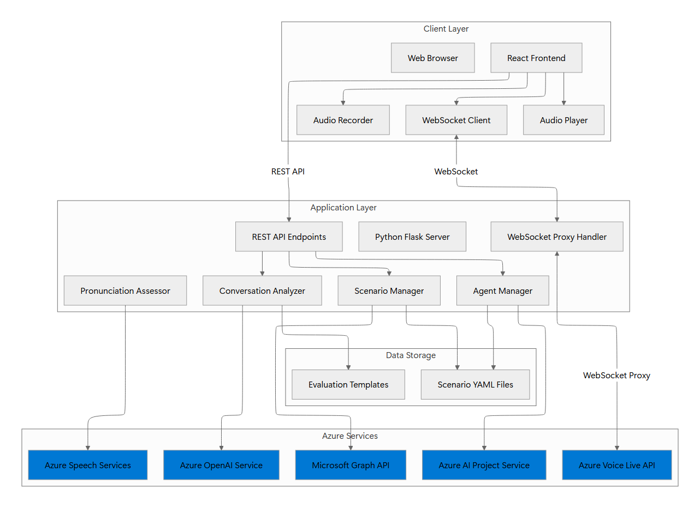
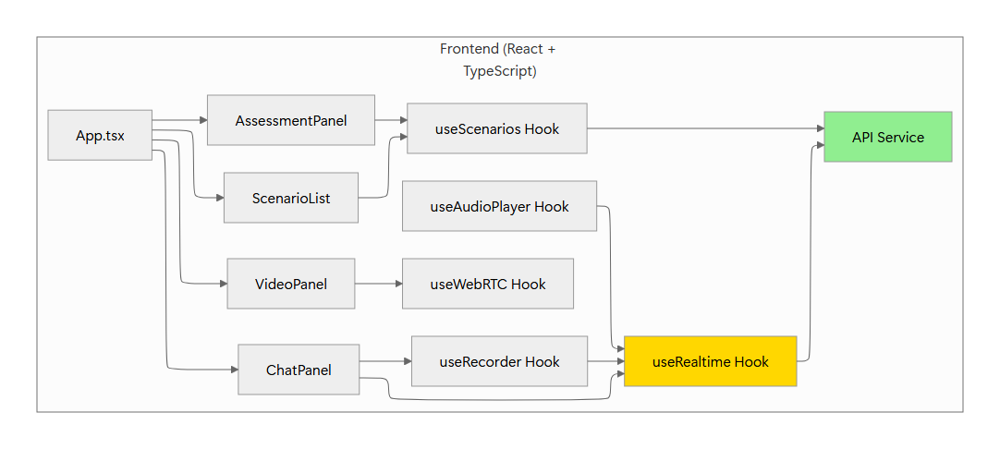
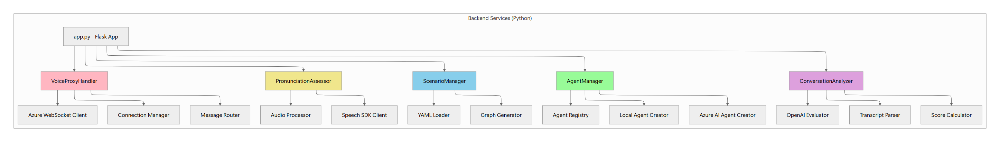
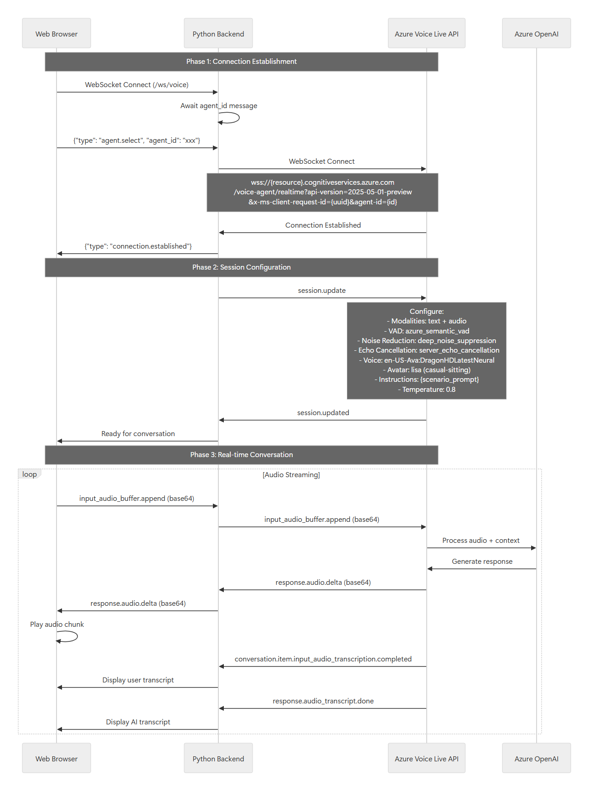
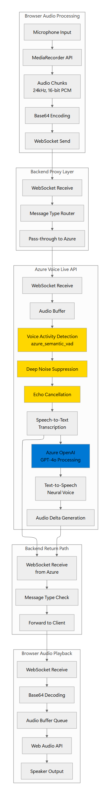

# VoiceLive API Sales Coach - Architecture

## Overview

Real-time AI-powered sales training platform using Azure Voice Live API. Trainees practice conversations with AI-powered virtual customers that respond naturally via voice.

**Core Technologies:**
- **Azure Voice Live API** - Real-time voice conversations
- **Azure OpenAI (GPT-4o)** - AI customer responses
- **React + TypeScript** - Frontend
- **Python Flask** - Backend WebSocket proxy
- **Azure Speech Services** - Pronunciation assessment

---

## Architecture



**Key Flow:**
1. Frontend connects to Flask backend via WebSocket
2. Backend proxies to Azure Voice Live API
3. Audio streams bidirectionally in real-time
4. AI generates natural voice responses
5. Post-conversation analysis via Azure OpenAI

---

## Components

### Frontend


- **useRealtime** - WebSocket connection manager
- **useRecorder** - Microphone audio capture (24kHz PCM)
- **useAudioPlayer** - Plays AI audio responses
- **ChatPanel** - Real-time transcripts
- **AssessmentPanel** - Performance scores

### Backend


- **VoiceProxyHandler** - WebSocket proxy (client ↔ Azure)
- **AgentManager** - Creates local or Azure AI agents
- **ScenarioManager** - Loads training scenarios from YAML
- **ConversationAnalyzer** - Evaluates performance (Azure OpenAI)
- **PronunciationAssessor** - Speech quality scoring

---

## Azure Voice Live API Integration

### Connection Architecture



### Voice Live API Configuration Details

The backend configures the Azure Voice Live API with specific parameters to ensure optimal real-time voice interaction:

```python
# Located in: backend/src/services/websocket_handler.py

session_config = {
    "type": "session.update",
    "session": {
        # Enable both text and audio modalities for full interaction
        "modalities": ["text", "audio"],

        # Voice Activity Detection - detects when user stops speaking
        "turn_detection": {
            "type": "azure_semantic_vad",  # Semantic-aware VAD
            # Automatically triggers AI response when user pauses
        },

        # Audio processing pipelines
        "input_audio_noise_reduction": {
            "type": "azure_deep_noise_suppression"  # Removes background noise
        },
        "input_audio_echo_cancellation": {
            "type": "server_echo_cancellation"  # Prevents feedback loops
        },

        # Visual avatar configuration
        "avatar": {
            "character": "lisa",
            "style": "casual-sitting"
        },

        # Voice synthesis settings
        "voice": {
            "name": "en-US-Ava:DragonHDLatestNeural"  # High-quality neural TTS
        },

        # AI behavior configuration
        "instructions": scenario_instructions,  # Scenario-specific prompt
        "temperature": 0.8,  # Creativity level
        "max_response_output_tokens": "inf"  # No token limit
    }
}
```

### WebSocket URL Construction

```python
# Located in: backend/src/services/websocket_handler.py

def _build_azure_websocket_url(self, agent_id: str) -> str:
    """
    Construct Azure Voice Live API WebSocket URL.

    Format:
    wss://{resource_name}.cognitiveservices.azure.com/voice-agent/realtime
    ?api-version=2025-05-01-preview
    &x-ms-client-request-id={unique_uuid}
    &agent-id={agent_id}  # For Azure AI Agents
    OR
    &model={model_name}    # For instruction-based agents
    """
    base_url = f"wss://{resource_name}.cognitiveservices.azure.com"
    path = "/voice-agent/realtime"

    params = {
        "api-version": "2025-05-01-preview",
        "x-ms-client-request-id": str(uuid.uuid4())
    }

    if agent_id.startswith("local-agent"):
        # Local instruction-based agent
        params["model"] = config["model_deployment_name"]  # e.g., "gpt-4o"
    else:
        # Azure AI Agent Service agent
        params["agent-id"] = agent_id

    return f"{base_url}{path}?{urlencode(params)}"
```

---

## Audio Stream Processing

### Audio Pipeline Architecture



### Audio Message Flow

The system handles three main types of audio-related messages:

#### 1. Input Audio (User → Azure)

```javascript
// Frontend: hooks/useRecorder.ts
// Capture audio from microphone at 24kHz, mono, 16-bit PCM
const mediaRecorder = new MediaRecorder(stream, {
  mimeType: 'audio/webm',
  audioBitsPerSecond: 24000
});

// On audio data available
mediaRecorder.ondataavailable = (event) => {
  const base64Audio = await blobToBase64(event.data);

  // Send to backend via WebSocket
  websocket.send(JSON.stringify({
    type: 'input_audio_buffer.append',
    audio: base64Audio  // Base64-encoded audio chunk
  }));
};
```

```python
# Backend: services/websocket_handler.py
# Forward audio directly to Azure Voice Live API
async def _forward_client_to_azure(self, client_ws, azure_ws):
    """Stream user audio to Azure."""
    async for message in client_ws:
        data = json.loads(message)

        if data['type'] == 'input_audio_buffer.append':
            # Pass-through to Azure without modification
            await azure_ws.send(message)
```

#### 2. Output Audio (Azure → User)

```python
# Backend: services/websocket_handler.py
async def _forward_azure_to_client(self, azure_ws, client_ws):
    """Stream AI audio responses to client."""
    async for message in azure_ws:
        data = json.loads(message)

        if data['type'] == 'response.audio.delta':
            # Forward audio chunk to client
            await client_ws.send(message)
            # Audio is base64-encoded PCM data at 24kHz
```

```javascript
// Frontend: hooks/useAudioPlayer.ts
// Play audio chunks as they arrive
const playAudioChunk = (base64Audio: string) => {
  const audioData = base64ToArrayBuffer(base64Audio);
  const audioBuffer = await audioContext.decodeAudioData(audioData);

  const source = audioContext.createBufferSource();
  source.buffer = audioBuffer;
  source.connect(audioContext.destination);
  source.start();
};
```

#### 3. Transcription Messages

```python
# Backend forwards two types of transcriptions:

# User speech transcription
{
    "type": "conversation.item.input_audio_transcription.completed",
    "transcript": "I'm interested in your health insurance plans"
}

# AI response transcription
{
    "type": "response.audio_transcript.done",
    "transcript": "Great! Let me tell you about our options..."
}
```

### Audio Processing Features

**Deep Noise Suppression:**
- Azure's advanced noise reduction removes background sounds
- Configured via `azure_deep_noise_suppression`
- Improves speech recognition accuracy in noisy environments

**Echo Cancellation:**
- Prevents audio feedback when AI voice plays through speakers
- Server-side processing: `server_echo_cancellation`
- Essential for full-duplex communication

**Voice Activity Detection (VAD):**
- `azure_semantic_vad` understands conversational context
- Detects natural pauses vs. sentence breaks
- Automatically triggers AI response when user finishes speaking
- Prevents premature interruptions

---

### Agent Manager Implementation

```python
# Located in: backend/src/services/managers.py

class AgentManager:
    """Manages virtual training agents."""

    # Base instructions for all agents
    BASE_INSTRUCTIONS = """
    CRITICAL INTERACTION GUIDELINES:
    - You are playing the role of a CUSTOMER
    - The user is the health insurance SELLER practicing skills
    - Keep responses SHORT (max 3 sentences, phone style)
    - ALWAYS stay in character - never break role
    - Simulate natural speech: pauses, "um", hesitation
    - Show genuine human emotions appropriate to situation
    - Ask follow-up questions naturally
    - Avoid robotic language - speak like a real customer
    """

    def create_agent(self, scenario_id: str, scenario_data: Dict) -> str:
        """Create agent (local or Azure-based)."""

        # Extract scenario configuration
        scenario_instructions = scenario_data["messages"][0]["content"]
        combined_instructions = scenario_instructions + self.BASE_INSTRUCTIONS

        model_name = scenario_data.get("model", "gpt-4o")
        temperature = scenario_data.get("modelParameters", {}).get("temperature", 0.7)

        # Route to appropriate creator
        if self.use_azure_ai_agents and self.project_client:
            return self._create_azure_agent(
                scenario_id,
                combined_instructions,
                model_name,
                temperature
            )
        else:
            return self._create_local_agent(
                scenario_id,
                combined_instructions,
                model_name,
                temperature
            )
```

### Local Agent Creation

```python
def _create_local_agent(
    self,
    scenario_id: str,
    instructions: str,
    model: str,
    temperature: float,
    max_tokens: int
) -> str:
    """
    Create instruction-based agent.

    These agents don't persist in Azure - instructions are sent
    directly to Voice Live API during session.update.
    """
    agent_id = f"local-agent-{uuid.uuid4().hex[:8]}"

    self.agents[agent_id] = {
        "id": agent_id,
        "scenario_id": scenario_id,
        "instructions": instructions,
        "model": model,
        "temperature": temperature,
        "max_tokens": max_tokens,
        "created_at": datetime.now().isoformat(),
        "type": "local"
    }

    logger.info(f"Created local agent: {agent_id}")
    return agent_id
```

### Azure AI Agent Creation

```python
def _create_azure_agent(
    self,
    scenario_id: str,
    instructions: str,
    model: str,
    temperature: float,
    max_tokens: int
) -> str:
    """
    Create persistent agent using Azure AI Project Service.

    These agents are registered in Azure and can be reused
    across multiple sessions.
    """
    agent_name = f"agent-{scenario_id}-{uuid.uuid4().hex[:8]}"

    # Call Azure AI Project Service
    agent = self.project_client.agents.create_agent(
        model=model,
        name=agent_name,
        instructions=instructions,
        tools=[],  # No function calling needed
        temperature=temperature
    )

    agent_id = agent.id  # Azure-generated ID

    self.agents[agent_id] = {
        "id": agent_id,
        "scenario_id": scenario_id,
        "azure_agent_id": agent_id,
        "model": model,
        "temperature": temperature,
        "created_at": datetime.now().isoformat(),
        "type": "azure"
    }

    logger.info(f"Created Azure AI agent: {agent_id}")
    return agent_id
```

### Agent Registry Structure

```python
# In-memory agent registry
self.agents = {
    "local-agent-abc123": {
        "id": "local-agent-abc123",
        "scenario_id": "scenario1",
        "instructions": "You are Frau Müller, a 42-year-old...",
        "model": "gpt-4o",
        "temperature": 0.7,
        "max_tokens": 2000,
        "created_at": "2025-12-09T10:30:00",
        "type": "local"
    },
    "asst_xyz789": {
        "id": "asst_xyz789",
        "scenario_id": "scenario2",
        "azure_agent_id": "asst_xyz789",
        "model": "gpt-4o",
        "temperature": 0.8,
        "created_at": "2025-12-09T10:35:00",
        "type": "azure"
    }
}
```

### Scenario Structure (YAML)

```yaml
# Located in: data/scenarios/scenario1-role-play.prompt.yml

name: Health Insurance Consultation Role-Play
description: Practice as insurance advisor with customer
model: gpt-4o
modelParameters:
  temperature: 0.7
  max_tokens: 2000

messages:
  - role: system
    content: |
      You are Frau Müller, a 42-year-old mother from Zürich.
      You're calling your insurance company about new premiums.

      YOUR CHARACTER PROFILE:
      - Married, two children (8 and 12 years old)
      - Currently at CHF 300 deductible
      - Had only routine checkup last year
      - Worried about rising healthcare costs
      - Interested in saving money but wants good coverage

      CONCERNS TO EXPRESS:
      1. How much are premiums increasing next year?
      2. Should I raise my deductible to save on premiums?
      3. What happens with unexpected health costs?
      4. Which supplementary insurance makes sense for my family?

      Respond naturally as Frau Müller would, with a mix of
      interest and financial caution.
```

### How Agents Connect to Voice Live API

```python
# Located in: backend/src/services/websocket_handler.py

async def _connect_to_azure(self, agent_id: str):
    """Establish WebSocket connection to Azure Voice Live API."""

    # Get agent data from registry
    agent_data = self.agent_manager.get_agent(agent_id)

    # Build WebSocket URL
    url = self._build_azure_websocket_url(agent_id)
    # wss://{resource}.cognitiveservices.azure.com/voice-agent/realtime
    # ?api-version=2025-05-01-preview
    # &x-ms-client-request-id={uuid}
    # &agent-id={agent_id}  (for Azure AI agents)
    # &model=gpt-4o         (for local agents)

    # Connect to Azure
    azure_ws = await websockets.connect(
        url,
        extra_headers={
            "api-key": config["azure_openai_api_key"]
        }
    )

    # Send session configuration
    if agent_data["type"] == "local":
        # For local agents, send instructions in session.update
        await self._send_session_update(
            azure_ws,
            instructions=agent_data["instructions"],
            temperature=agent_data["temperature"]
        )
    else:
        # For Azure AI agents, instructions already stored
        # Just configure audio/voice settings
        await self._send_session_update(
            azure_ws,
            instructions=None,  # Already in Azure
            temperature=agent_data["temperature"]
        )

    return azure_ws
```

---

## Security and Authentication

### API Key Management

```python
# Located in: backend/src/config.py

class Config:
    """Secure configuration management."""

    def __init__(self):
        # Load from .env file (development)
        load_dotenv()

        self._config = {
            # Voice Live API
            "azure_ai_resource_name": os.getenv("AZURE_AI_RESOURCE_NAME"),
            "azure_ai_region": os.getenv("AZURE_AI_REGION"),

            # Azure OpenAI
            "azure_openai_endpoint": os.getenv("AZURE_OPENAI_ENDPOINT"),
            "azure_openai_api_key": os.getenv("AZURE_OPENAI_API_KEY"),

            # Speech Services
            "azure_speech_key": os.getenv("AZURE_SPEECH_KEY"),
            "azure_speech_region": os.getenv("AZURE_SPEECH_REGION"),

            # AI Project Service
            "project_endpoint": os.getenv("PROJECT_ENDPOINT"),
            "subscription_id": os.getenv("SUBSCRIPTION_ID"),
            "resource_group_name": os.getenv("RESOURCE_GROUP_NAME"),
        }
```

### WebSocket Security

```python
# Located in: backend/src/services/websocket_handler.py

async def _connect_to_azure(self, agent_id: str):
    """Connect to Azure with authentication."""

    url = self._build_azure_websocket_url(agent_id)

    # Authenticate with API key
    azure_ws = await websockets.connect(
        url,
        extra_headers={
            "api-key": config["azure_openai_api_key"]
        }
    )

    return azure_ws
```

---

## Deployment Architecture

### Container Architecture


### Infrastructure as Code (Bicep)

```bicep
// Located in: infra/main.bicep

// Azure OpenAI Service
resource openai 'Microsoft.CognitiveServices/accounts@2023-05-01' = {
  name: openaiName
  location: location
  kind: 'OpenAI'
  sku: {
    name: 'S0'
  }
  properties: {
    customSubDomainName: openaiName
    publicNetworkAccess: 'Enabled'
  }
}

// GPT-4o deployment for Voice Live API
resource gpt4oDeployment 'Microsoft.CognitiveServices/accounts/deployments@2023-05-01' = {
  parent: openai
  name: 'gpt-4o'
  sku: {
    name: 'Standard'
    capacity: 80  // Throughput units
  }
  properties: {
    model: {
      format: 'OpenAI'
      name: 'gpt-4o'
      version: '2024-08-06'
    }
  }
}

// Azure Speech Service
resource speech 'Microsoft.CognitiveServices/accounts@2023-05-01' = {
  name: speechName
  location: location
  kind: 'SpeechServices'
  sku: {
    name: 'S0'
  }
}

// Container App Environment
resource containerAppEnv 'Microsoft.App/managedEnvironments@2023-05-01' = {
  name: '${abbrs.appManagedEnvironments}${resourceToken}'
  location: location
  properties: {
    appLogsConfiguration: {
      destination: 'log-analytics'
      logAnalyticsConfiguration: {
        customerId: logAnalytics.properties.customerId
        sharedKey: logAnalytics.listKeys().primarySharedKey
      }
    }
  }
}

// Backend Container App
resource backend 'Microsoft.App/containerApps@2023-05-01' = {
  name: 'backend'
  location: location
  properties: {
    managedEnvironmentId: containerAppEnv.id
    configuration: {
      ingress: {
        external: true
        targetPort: 8000
        transport: 'auto'  // Supports WebSocket
      }
      secrets: [
        {
          name: 'azure-openai-api-key'
          value: openai.listKeys().key1
        }
        {
          name: 'azure-speech-key'
          value: speech.listKeys().key1
        }
      ]
    }
    template: {
      containers: [
        {
          name: 'backend'
          image: '${containerRegistry.properties.loginServer}/backend:latest'
          env: [
            {
              name: 'AZURE_OPENAI_ENDPOINT'
              value: openai.properties.endpoint
            }
            {
              name: 'AZURE_OPENAI_API_KEY'
              secretRef: 'azure-openai-api-key'
            }
            {
              name: 'AZURE_SPEECH_REGION'
              value: location
            }
          ]
          resources: {
            cpu: json('1.0')
            memory: '2Gi'
          }
        }
      ]
      scale: {
        minReplicas: 1
        maxReplicas: 10
        rules: [
          {
            name: 'http-rule'
            http: {
              metadata: {
                concurrentRequests: '10'
              }
            }
          }
        ]
      }
    }
  }
}

// Static Web App (Frontend)
resource frontend 'Microsoft.Web/staticSites@2022-09-01' = {
  name: frontendName
  location: location
  sku: {
    name: 'Standard'
  }
  properties: {
    buildProperties: {
      appLocation: 'frontend'
      apiLocation: ''
      outputLocation: 'dist'
    }
  }
}
```

---

## Key Architectural Patterns

### 1. Proxy Pattern
The backend acts as a **WebSocket proxy** between the client and Azure Voice Live API:
- **Hides credentials** from client
- **Manages connection lifecycle**
- **Routes messages bidirectionally**
- **Adds logging and monitoring**

### 2. Strategy Pattern
The system supports **two agent creation strategies**:
- **Local instruction-based**: Direct prompt injection
- **Azure AI Agents**: Persistent agent service

### 3. Template Method Pattern
**Scenario loading** and **evaluation** follow consistent patterns:
- Load YAML template
- Parse configuration
- Apply to runtime

### 4. Observer Pattern
**WebSocket communication** follows observer pattern:
- Client observes backend events
- Backend observes Azure events
- Loose coupling between layers

### 5. Factory Pattern
**AgentManager** acts as factory for creating agents:
- Encapsulates creation logic
- Returns uniform interface
- Hides implementation details

---

## Performance Considerations

### Latency Optimization
- **WebSocket streaming**: Sub-100ms audio chunks
- **Voice Activity Detection**: Minimizes dead air
- **Audio compression**: Base64 encoding for efficiency
- **Parallel processing**: Conversation + pronunciation analysis

### Scalability
- **Stateless backend**: Each WebSocket is independent
- **Azure auto-scaling**: Container Apps scale based on load
- **Connection pooling**: Reuse Azure SDK clients
- **In-memory agent registry**: Fast lookup

### Cost Optimization
- **Pay-per-use**: Azure OpenAI token-based pricing
- **Auto-scaling**: Scale down when idle
- **Efficient prompts**: Keep instructions concise
- **Caching**: Reuse agent definitions

---

## Monitoring and Observability

### Logging Strategy

```python
# Located throughout codebase

import logging

logger = logging.getLogger(__name__)

# Connection events
logger.info(f"Client connected from {client_ip}")
logger.info(f"Connected to Azure Voice Live API")

# Message flow
logger.debug(f"Forwarding message type: {message_type}")

# Errors
logger.error(f"Failed to connect to Azure: {error}")

# Performance
logger.info(f"Analysis completed in {duration}ms")
```

### Application Insights Integration

```python
# Located in: backend/src/app.py

from opencensus.ext.azure.log_exporter import AzureLogHandler

# Configure Application Insights
logger.addHandler(AzureLogHandler(
    connection_string=config["APPLICATIONINSIGHTS_CONNECTION_STRING"]
))

# Track custom metrics
from opencensus.ext.azure import metrics_exporter

exporter = metrics_exporter.new_metrics_exporter(
    connection_string=config["APPLICATIONINSIGHTS_CONNECTION_STRING"]
)

# Track WebSocket connection count
metrics.record_measurement("websocket.active_connections", 1)
metrics.record_measurement("analysis.duration_ms", analysis_time)
```

---

## Conclusion

The VoiceLive API Sales Coach demonstrates a **modern, cloud-native architecture** leveraging Azure's AI services for real-time voice-based training. Key architectural strengths include:

1. **Real-time Performance**: Sub-second audio streaming via WebSocket
2. **AI Integration**: Multiple Azure AI services working together
3. **Scalability**: Stateless design enables horizontal scaling
4. **Security**: Credential isolation via proxy pattern
5. **Flexibility**: Support for both local and Azure-managed agents
6. **Observability**: Comprehensive logging and monitoring

This architecture provides a solid foundation for building production-grade, AI-powered voice applications.

---

**Document Version**: 1.0
**Last Updated**: December 9, 2025
**Maintained By**: VoiceLive API Sales Coach Team
